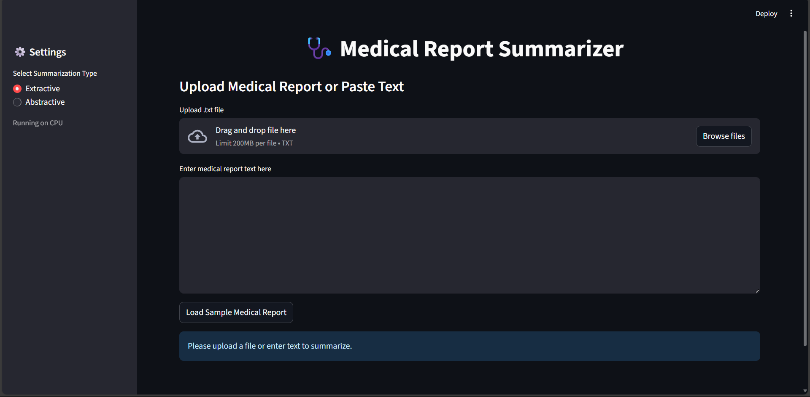

# 🩺 **Medical Report Summarizer**
A powerful **AI-driven web application** that summarizes lengthy medical reports using **Extractive (TextRank)** and **Abstractive (BART Transformer)** techniques.  
Built for **doctors, healthcare professionals, and researchers** to quickly extract meaningful insights from complex clinical documents.  

---

## 🚀 **Key Features**
✔ **Two Summarization Modes**
   - **Extractive Summarization**: Selects the most important sentences using **TextRank**.
   - **Abstractive Summarization**: Generates **human-like summaries** using **HuggingFace BART model**.

✔ **Modern Dark-Themed UI**
   - Clean, professional design with **tags**, **cards**, and **stats visualization**.

✔ **Upload or Paste Reports**
   - Handles **large medical documents** with smart **text chunking** for abstractive summarization.

✔ **Performance Insights**
   - Displays **original vs summarized word count**, **compression ratio**, and **time taken**.

✔ **Export Summary**
   - Download the summary as a **.txt file** for records.

✔ **Sample Reports**
   - One-click demo with a **preloaded medical report**.

---

## 📸 **UI Preview** 


---

## 🛠 **Tech Stack**
| Component      | Technology |
|---------------|------------|
| **Frontend**  | Streamlit |
| **Extractive**| NLTK + TextRank (NetworkX) |
| **Abstractive**| HuggingFace Transformers (BART) |
| **Backend**   | Python 3.9+ |
| **Deployment**| Streamlit, Docker (Optional) |

---

## ⚙️ **Installation Guide**

### ✅ 1. Clone the Repository
```bash
git clone https://github.com/yourusername/medical-report-summarizer.git
cd medical-report-summarizer
```

### ✅ 2. Create Virtual Environment (Recommended)
```bash
python -m venv venv
source venv/bin/activate   # Mac/Linux
venv\Scripts\activate      # Windows
```

### ✅ 3. Install Dependencies
#### **Option A: From `requirements.txt`**
```bash
pip install -r requirements.txt
```

#### **Option B: Direct Install**
```bash
pip install streamlit nltk scikit-learn networkx torch transformers
```

---

## ▶️ **Run the App**
```bash
streamlit run app.py
```
Then open your browser at: **`http://localhost:8501`**

---

## 📂 **Project Structure**
```
medical-report-summarizer/
│
├── app.py                # Main Streamlit application
├── requirements.txt      # Project dependencies
├── README.md             # Documentation
└── sample_reports/       # Example medical reports
```

---

## 🧠 **How It Works**

### **Extractive Summarization**
- Uses **TextRank Algorithm**:
  1. Splits text into sentences using **NLTK**.
  2. Computes **TF-IDF similarity** between sentences.
  3. Builds a **graph** and applies **PageRank** to rank sentences.
  4. Picks **top N sentences** for summary.

✅ **Fast & Lightweight** → Works even on **CPU**.

---

### **Abstractive Summarization**
- Uses **BART Transformer (`facebook/bart-large-cnn`)**:
  1. Breaks long text into **chunks with overlaps** for context.
  2. Summarizes each chunk using **BART**.
  3. Combines partial summaries into **final summary**.

✅ **Human-like Summaries** → Recommended for **better readability**.
⚠ **GPU Recommended** for large reports.

---

## 📋 **Sample Medical Report**
```
Patient Name: John Doe
Age: 45
Diagnosis: Type 2 Diabetes Mellitus
Medications: Metformin 500mg twice daily
Lab Results: Fasting blood glucose - 145 mg/dL, HbA1c - 7.8%
Plan: Continue Metformin, start lifestyle modifications, follow-up in 3 months.
```

---

## 📊 **Example Output**

**Original Length:** 150 words  
**Extractive Summary:** 50 words  
**Abstractive Summary:** 45 words  
**Compression Ratio:** 66%

---

## ✅ **Future Enhancements**
- 📄 **PDF Upload Support**
- 🌍 **Multi-language Summarization**
- 🔍 **NER (Highlight Diagnoses & Medications)**
- 📤 **Export to PDF or Word**
- ☁ **Cloud Deployment with GPU**

---

## ⚠️ **Performance Notes**
- **GPU Recommended** for abstractive mode (BART is heavy).
- Reduce **chunk size** if you face **CUDA Out of Memory** error.
- Extractive summarization runs **fully on CPU**, no GPU needed.

---

## 📜 **License**
This project is licensed under the **MIT License**.

---

## 👨‍💻 **Contributors**
- **DEVATHARANI G S** – Developer & Maintainer
